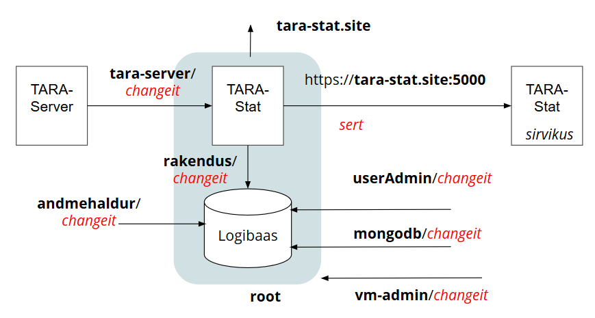

# Mikroteenus TARA-Stat
{: .no_toc}

## Ülevaade
{: .no_toc}

TARA-Stat on mikroteenus [autentimisteenuse TARA](https://e-gov.github.io/TARA-Doku) kasutusstatistika tootmiseks ja vaatamiseks. 

Käesolev dokument spetsifitseerib kogu teabe, mis on vajalik teenuse paigaldamiseks, käitamiseks ja kasutamiseks. 

Dokument on mõeldud TARA-Stat paigaldajale, käitajale ja kasutajale. Samuti võib dokument pakkuda huvi mikroteenuste arhitektuurist huvitujatele  - näitena või võrdlusmaterjalina - muudes arendustes.

Kõik viited salasõnadele ja tundlikele taristuparameetritele (nt hostinimed, pordid, kasutajanimed) siin dokumendis on illustratiivsed ja kuuluvad toodangupaigalduses ümbervaatamisele, salasõnade osas aga kindlasti asendamisega turvalistega.

TARA-Stat-i on arendanud Riigi Infosüsteemi Amet.

(Eraldi _write-up_ mikroteenusarhitektuurist, kui peaksid huvi tundma: [https://e-gov.github.io/TARA-Stat/](https://e-gov.github.io/TARA-Stat/))


## Sisukord
{: .no_toc}

- TOC
{:toc}

## 1 Funktsioon

TARA-Stat on mikroteenus [autentimisteenuse TARA](https://e-gov.github.io/TARA-Doku) kasutusstatistika tootmiseks ja vaatamiseks.

TARA-Stat pakub:

- võimalust autentimisteenuses fikseeritud autentimistoimingute logimiseks
- võimalust logi põhjal lihtsa - kuid autentimisteenuse haldamiseks vajaliku statistika arvutamiseks ja vaatamiseks

Eelkõige huvitab autentimiste arv klientrakenduste lõikes ajaperioodil.

Üldistatud arhitektuurijoonis:

<p style='text-align:center;'></p>

TARA-Stat kasutajaliides statistikakasutajale:

<p style='text-align:center;'></p>

## 2 Komponendid ja liidesed

TARA-Stat koosneb kahest komponendist ja neljast liidesest.

| komponent | otstarve |
|-----------|----------|
| veebirakendus | Node.js rakendus, mis ühelt poolt võtab vastu logikirjed ja salvestab need logibaasi. Teiselt poolt arvutab kasutusstatistika ja esitab seda statistikakasutajale. Koosneb omakorda serveripoolsest osast ja  kasutaja sirvikusse laetavast osast |
| logibaas | MongoDB andmebaas, kus salvestatakse logikirjeid |

| liides    | otstarve |
|-----------|----------|
| logikirje lisamise liides (otspunkt) | HTTPS REST JSON otspunkt, mille kaudu TARA-Stat võtab TARA-Server-lt vastu logikirjeid |
| statistika väljastamise  (otspunkt) | HTTPS veebiliides, mille kaudu statistikakasutaja tutvub kasutusstatistikaga |
| logibaasi haldamise liides | MongoDB käsureaklient, millega aeg-ajalt puhastatakse logibaasi aegunud kirjetest |
| elutukse liides | HTTPS otspunkt, millelt saab pärida kinnitust TARA-Stat elusoleku kohta |

### 2.1 Logikirje lisamise otspunkt

Saata `POST` päring `https://<tara-stat>` (kus `<tara-stat>` on TARA-Stat-i domeeninimi), mille kehas on JSON kujul

```
{ 
  "aeg": <ISO date>,
  "klient": <klientrakenduse nimi>,
  "meetod": <MobileID,  ID_CARD, eIDAS vm meetod>
}
```

`ISO date` on ajatempel kujul `2018-04-28`, millele võib järgneda kellaaja osa.

### 2.2 Statistika väljastamise otspunkt (statistikakasutaja UI)

Statistikakasutaja sirvikus avada leht `https://<tara-stat>` (kus `<tara-stat>` on TARA-Stat-i domeeninimi).

Määrata periood (võib jääda ka tühjaks)
- sisestades regulaaravaldise
- nt `2018-04` valib 2018. a aprilli logikirjed
- vajutada nupule
- kuvatakse autentimiste arv perioodi jooksul klientrakenduste lõikes

### 2.3 Elutukse otspunkt

Päringu `https://<tara-stat>/status` saamisel kontrollib TARA-Stat oma logibaasi ülevalolekut. Kui logibaas on üleval, siis tagastatakse HTTP vastus `200` `OK`,
- vastasel korral `500` `Internal Server Error`.

## 3 Suhtluse osapooled

TARA-Stat suhtleb 5 välise osapoolega.

| väline osapool | selgitus |
|----------------|----------|
| statistikakasutaja | autentimisteenust TARA käitava organisatsiooni teenistuja - teenusehaldur või tootejuht- kes vajab teavet teenuse kasutamise mahu, sh trendide kohta. Statistikakasutajale tuleb pakkuda statistikat. Eriti vajalik on teave teenuse tarbimismahtudest klientrakenduste lõikes. Statistikakasutajal peab olema võimalik ette anda periood, mille kohta statistika arvutatakse. Statistikakasutajal ei tohi olla võimalust logi muuta.<br><br>Kuna statistika on üldistatud ega sisalda isikuandmeid, lähtume statistika otspunkti turvamisel, et otspunkt on avatud organisatsiooni sisevõrgus, kõigile töötajatele. |
| TARA-Server | saadab TARA-Stat-i logikirjeid. TARA-Server võib olla paigaldatud mitmes instantsis. |
| andmehaldur | inimene, kes, kasutades MongoDB standardvahendeid - käsurealiidest `mongo` - kustutab logibaasist aegunud kirjeid. (Kasutusstatistika pakub huvi u aasta jooksul). See on harv tegevus. |
| admin | inimene, kes paigaldab tarkvara, loob andmebaasi kasutajatele (TARA-Server, andmehaldur) kontod ja annab pääsuõigused. |
| monitooringusüsteem | saab TARA-Stat-le saata "elutuksepäringu". TARA-Stat vastab, kas ta toimib. |

## 4 Turvamine

TARA-Stat-is on rakendatud järgmised turvavalikud.

1. Omaette VM. TARA-Stat paigaldatakse eraldi VM-i. VM-is ei ole teisi rakendusi. 
1. Ainult sisevõrgus. Mikroteenus on ligipääsetav ainult organisatsiooni sisevõrgus.
1. API kaitse võti. Logikirje lisamise otspunkt kaitstakse API võtmega (salasõnaga). API võti paigaldatakse TARA-Serverisse ja pannakse kaasa igas päringus logikirje lisamise otspunkti poole. Statistika väljastamise otspunkt API võtmega kaitset ei vaja, kuid on ligipääsetav ainult organisatsiooni sisevõrgus. Elutukse otspunkt on ligipääsetav ainult organisatsiooni sisevõrgus.
1. HTTPS. Veebirakendus API-s ainult HTTPS.
1. Andmebaasikasutaja autentimine. Veebirakendus pöördub MongoDB poole eraldi andmebaasikasutajana (`rakendus`). Andmebaasikasutaja autenditakse. Kasutusel on MongoDB vaikimisi autentimismehhanism - soolaga salasõna põhine.
1. Rollipõhine pääsuhaldus andmebaasis. Admin on eraldi andmebaasikasutaja.
1. Veebirakenduse ja MongoDB suhtluses ei rakendata TLS-i. Kuna andmebaas suhtleb ainult samas masinas oleva rakendusega ja masinas ei ole teisi rakendusi, ei ole TLS-i hädavajalik.
1. Andmebaasi ei krüpteerita, kuna konfidentsiaalsusvajadus ei ole kõrge.
1. Nii veebirakendus kui ka MongoDB käitatakse eraldi, spetsiaalsete kasutajate alt (`tarastat` ja `mongodb`).
1. Ligipääs andmebaasile (kirjutamine) on kaitstud ka failisüsteemi õiguste tasemel.
1. Andmebaasi võrgus nähtavuse piiramine. Andmebaas ei ole nähtav VM-st väljapoole. Andmebaasi kasutab ainult samas masinas asuv veebirakendus. 
1. Andmebaasi auditilogi ei peeta, kuna terviklusvajadus ei ole nii kõrge.

Vajadusel vt taustaks:
- MongoDB [turvakäsitlus](https://docs.mongodb.com/manual/security/) sisaldab [turvameelespead](https://docs.mongodb.com/manual/administration/security-checklist/) rea soovitustega.

## 5 Identiteedid ja kredentsiaalid

Osapooltel on identiteedid (nimed), mida tõendavad kredentsiaalid (paroolid, võtmed).

TARA-Stat käitluskontekstis on 9 osapoolt (subjekti), kes vajavad identiteedi ja kredentsiaalide andmist ning õiguste seadmist.

| kasutaja vm õiguste subjekt (_principal_), masinloetava nimega | subjekti liik ja kirjeldus | kredentsiaalid |
|:--------:|:-------:|:--------------:|
| `admin` | Ubuntu kasutaja, kes paigaldab tarkvara ja teeb muid haldustoiminguid | salasõna |
| `tarastat` | Ubuntu kasutaja, kelle alt käivitatakse TARA-Stat veebirakendus | salasõna |
| `mongodb` | Ubuntu kasutaja, kelle alt käitatakse Mongo DB andmebaas | 
| `userAdmin` | MongoDB kasutaja, kes haldab MongoDB kasutajaid. Seda rolli täidab VM admin | salasõna |
| `rakendus` | TARA-Stat veebirakenduse konto MongoDB-s | salasõna |
| `andmehaldur` | MongoDB konto, mille alt kustutatakse aegunud logikirjeid. Andmehalduri rolli täidab VM admin | salasõna |
| `https://tara-stat.site` | TARA-Stat veebirakendus | _self-signed_ sert |
| - | statistikakasutaja - anonüümne inimene, kes pöördub sisevõrgust TARA-Stat veebirakenduse statistika väljastamise otspunkti poole | ei autendita, juurdepääs piiratakse kontekstiga |
| `tara-server` | TARA-Server, pöördub TARA-Stat logikirjete vastuvõtmise otspunkti poole | API kasutajanimi ja salasõna |

<p style='text-align:center;'></p>

## 6 Sõltuvused

Tootmissõltuvused:

| sõltuvus | versioon | selgitus, sh milleks vajalik |
|----------|----------|-----------------|
| backend: | | |
| Ubuntu   | 16 LTS   | suure tõenäosusega sobib ka hilisem |
| Node.js  | 6.x      | veebirakendus   |
| body-parser | standardne | veebirakendus |
| ejs         | standardne | veebirakendus |
| express | standardne | veebirakendus |
| mongodb | standardne | MongoDB klient, veebirakendus |
| request | standardne | veebirakendus |
| basic-auth | standardne | veebirakendus |
| request-debug | standardne | veebirakendus |
| MongoDB  | 3.6.4 | logibaas |
| frontend: | | |
| HTML5, Css3, Javascript | | |
| jQuery | | |
| Material Design ikoonid | | |

Arendussõltuvused

| sõltuvus | versioon | selgitus, sh milleks vajalik |
|----------|----------|-----------------|
| GitHub | | avalik koodirepo |
| Jekyll | | avaliku dok-ni publitseerimine |

Märkus. "Standardne" tähendab laialt kasutatavat, stabiilset teeki, millest `npm` abil paigaldatakse viimane versioon. Kui versioon on tühi, siis kasutatakse standardseid võimalusi, mis ei nõua sidumist konkreetse versiooniga.

## 7 Paigaldamine

TARA-Stat paigaldatakse põhiosas paigaldusskriptidega, seejuures on vaja ka käsitsi tegevusi.

Järgnevas eeldame, et:
- virtuaalmasin (VM) on loodud
- Ubuntu 16 LTS on paigaldatud
- paigaldaja (admin) on sudo-õigustega kasutajana sisse loginud. 

### 7.1 Paigaldusskriptid

Paigaldamisel saab kasutada järgmisi skripte:

| paigaldusskript | ülesanne |
|--------|----------|
| `TARA-Stat-paigalda-Nodejs.sh` | paigaldab Node.js |
| `TARA-Stat-paigalda-MongoDB.sh` | paigaldab MongoDB ja seadistab logibaasi |
| `TARA-Stat-seadista-rakendus.sh` | seadistab veebirakenduse |
| `TARA-Stat-paigalda-votmed.sh` | paigaldab veebirakenduse HTTPS privaatvõtme ja serdi |
| `TARA-Stat-diagnoosi.sh` | väljastab diagnostilist teavet paigalduse kohta |

Skriptid asuvad koodirepo kaustas `/opt/TARA-Stat/scripts`.

Skriptid on kommenteeritud - igas skripti päises on kirjeldatud täidetavad sammud. Enne paigaldamist tutvu skriptitekstidega.

### 7.2 Konfigureerimine

Konfigureeritakse järgmiste failidega:

| fail        | eesmärk ja kasutamine |
|-------------|-----------------------|
| `/opt/TARA-Stat/config.js` | veebirakenduse konf-n. Konfigureeritakse paigaldusskriptiga `TARA-Stat-paigalda-rakendus.sh`. Käsitsi konf-mine on vajalik siis, kui tahetakse muuta tundlike taristuparameetrite vaikeväärtusi (nt porti). |
| `/etc/mongodb.conf`        | MongoDB konf-n. Kasutatakse vaikimis konf-i. Käsitsi konf-mine on vajalik siis, kui tahetakse muuta tundlike taristuparameetrite vaikeväärtusi (nt porti). |

Veebirakenduse konfi-failis seatud väärtusi saab vajadusel üle määrata teenuse käivitamiskäsus (`process.env` mehhanismiga).

### 7.3 Esmakordne paigaldamine

**Eeltegevused**. Valmista VM ja paigalda Ubuntu (16 LTS server).

**Paigalda koodirepo**. Alusta paigaldamist TARA-Stat koodi paigaldamisega koodirepost VM-i. Järgnevas eeldame, et TARA-Stat kood asub GitHub-is, kuid võib olla ka siserepos.

Paigalda TARA-Stat kood kausta `/opt/TARA-Stat`.

`sudo rm -R /opt/TARA-Stat` (kustuta vana; valikuline)

`cd /opt`

`sudo git clone https://github.com/e-gov/TARA-Stat` 

Seejärel leiad koodirepo kaustast `/opt/TARA-Stat/scripts` paigaldusskriptid, millega saad edasist tööd automatiseerida.

`cd /opt/TARA-Stat/scripts`

Märkus. Edasiarendusvõimalusena võib kaaluda paigaldusskriptide põhjal Jenkinsi paigalduskonveieri ehitamist.

**Paigalda Node.js**. 

`sudo bash TARA-Stat-paigalda-Nodejs.sh`

**Paigalda MongoDB**.

`sudo bash TARA-Stat-paigalda-MongoDB.sh` (Node.js ja MongoDB paigaldamise järjekord ei ole oluline)

**Seadista rakendus**.

`sudo bash TARA-Stat-seadista-rakendus.sh`

**Paigalda HTTPS võtmed**. kui rakenduses tuleb kasutada organisatsiooni CA väljaantud serti, siis loo võtmete kaust `../keys` (`TARA-Stat` naaberkaust) ja kopeeri sinna privaatvõti ja sert. Privaatvõtme faili nimi on vaikimisi `tara-stat.key` ja serdifaili nimi on vaikimisi `tara-stat.cert`. Kui soovid kasutada teisi nimesid, siis muuda vastavalt seadistusi failis `config.js`. _Self-signed_ võtmete korral genereeri uued võtmed ja sert:

`sudo bash TARA-Stat/scripts/TARA-Stat-genereeri-votmed.sh`

Seejärel sea kasutaja `tarastat` võtmete kausta omanikuks:

`sudo chown -R tarastat:tarastat /opt/keys`

**Käivita veebirakendus**. 

`sudo systemctl start tarastat`

**Kontrolli, et kõik töötab**. Kontrolli, et nii veebirakendus kui ka logibaas (teenus `mongodb`) töötavad. Selleks saad kasutada skripti:

`sudo bash TARA-Stat/scripts/TARA-Stat-diagnoosi.sh`

`TARA-Stat-diagnoosi.sh` väljastab diagnostilist teavet - selle skripti võib käivitada igal ajal; see skript ei muuda paigaldust.

### 7.4 HTTPS võtmete vahetamine

1\. Seiska TARA-Stat veebirakendus:

`sudo systemctl stop tarastat`

2\. Kanna uued võtmed kausta `../keys` (`TARA-Stat` naaberkaust). _Self-signed_ võtmete korral genereeri uued võtmed ja sert:

`sudo bash TARA-Stat/scripts/TARA-Stat-genereeri-votmed.sh`

3\. Taaskäivita veebirakendus:

`sudo systemctl start tarastat`

### 7.5 Tarkvarauuenduse paigaldamine

Kui tarkvarauuendus ei puuduta Node.js ega MongoDB-d, siis piisab 1. ja 3. sammu läbitegemisest. Täpne juhis, kas vajalik on täielik uuestipaigaldamine või on võimalik osaline uuestipaigaldamine, peab arendaja poolt kaasas olema konkreetse tarkvarauuendusega.

Väikese tarkvarauuenduse puhul on võimalik ka värskenduste tõmbamine repot üle kirjutamata:

`sudo git pull origin master` (kaustas `TARA-Stat`)

Enne seda tuleb aga teha

`sudo git checkout .`

sest kuna rakenduse seadistamisel on `config.js` muudetud, siis pull-i tegemisel tekib muidu konflikt.

### 7.5 VM tulemüüri seadistamine

Pääsureeglite seadmiseks VM tulemüüris pakume siin lähteandmed, kuid (kahjuks) mitte konkreetseid juhiseid. Vaja on tagada:

- TARA-Server-lt tulevate HTTPS päringute teenindamine
- statistikakasutajalt (pöördub sirvikuga) tulevate HTTPS päringute (sh AJAX) teenindamine
- monitooringulahenduselt (kui kasutatakse) tulevate HTTPS päringute teenindamine.

TARA-Stat kuulab vaikimisi HTTPS pordil 5000.

Vajadusel vt:
- [How to Install MongoDB on Ubuntu 16.04](https://www.digitalocean.com/community/tutorials/how-to-install-mongodb-on-ubuntu-16-04), Step 3.

Pääsureeglite seadmisel VLAN-is ja/või sisevõrgu ruuteri(te)s, samuti TARA-Serveris lähtu organisatsiooni võrgureeglitest.

## 8 Käivitamine, staatus ja seiskamine

Nii TARA-Stat veebirakendus kui ka MongoDB käitatakse systemd hallatavate teenustena. 

|    | TARA-Stat veebiteenus | MongoDB (logibaas) |
|----|-----------------------|--------------------|
| systemd teenusenimi | `tarastat` |  `mongodb`  |
| käitav Ubuntu kasutaja | `tarastat` | `mongodb` |

Teenused käivitatakse ja seisatakse standardsete `systemctl` käskudega, nt:

`systemctl start mongodb` (käivita teenus `mongodb`)

`systemctl status mongodb` (kuva teenuse `mongodb` staatus)

`systemctl stop mongodb` (peata teenus `mongodb`)

Ülalolevates näidetes saab siis `mongodb` asemel kasutada `tarastat`.

Teenuste `tarastat` ja `mongodb` käivitamise järjekord ei ole oluline. Kuid peab arvestama, et `tarastat` sõltub `mongodb`-st - kui logibaas ei ole üleval, siis ei saa logikirjeid salvestada ega statistikat väljastada.

TARA-Stat ülevalolekut saab lõppkasutaja seisukohast kontrollida nii:
- lülitu tööarvutiga organisatsiooni sisevõrku (VPN)
- sirvikus ava `https://tara-stat-<site>:5000`. Rakendus teatab, et ühendus ei ole turvaline. See on tingitud _self-signed_ serdist. Aktsepteeri turvaerind. Ilmub rakenduse avaleht.

## 9 Olulised asukohad

Koodirepo `https://github.com/e-gov/TARA-Stat`:

| kaust v fail | otstarve     |
|--------------|--------------|
| `index.js`   | veebirakendus |
| `scripts`    | paigaldusskriptid |
| `docs`       | dokumentatsioon |

TARA-Stat (paigaldus):

| konf-ifail | `/opt/TARA-Stat/config.js` |
| logi       | `/opt/TARA-Stat/log.txt` |
| systemd haldusüksuse kirjeldusfail | `/lib/systemd/system/tarastat.service` |

MongoDB (paigaldus):

| üksus      | selgitus  |
|------------|-----------|
| konf-ifail | `/etc/mongodb.conf` |
| logi       | `/var/log/mongodb/mongod.log` |
| andmebaasifailid | `var/lib/mongodb` |
| systemd haldusüksuse kirjeldusfail | `/lib/systemd/system/mongod.service` |
| automaatkäivitusskript | `/etc/init.d/mongodb` |

## 10 Diagnostika

Sirviku teated:

| teade v käitumine | võimalik põhjus |
|--------------|------------------|
|  `connection refused` | rakendus on maas |

Veebirakenduse veateated:

kood | veateade | vea lahendamise soovitus
ERR-01 | Logibaasiga ühendumine ebaõnnestus | Kontrollida, kas MongoDB töötab
ERR-02 | Viga logibaasist lugemisel | Kontrollida, kas MongoDB töötab
ERR-03 | Valesti moodustatud logikirje | Kontrollida logikirje saatmist TARA-Serveris
ERR-04 | Logibaasi poole pöörduja autentimine ebaõnnestus | Kontrollida API kasutajanime ja võtit
ERR-05 | Kirjutamine logibaasi ebaõnnestus | Kontrollida kettamahtu ja kirjutamisõigusi

### 10.1 Logibaasi seisu uurimine

Kui tekib vajadus välja selgitada, mis seisus on MongoDB andmebaasi sisu ja kasutajate kontod, siis tee järgmist:

`mongo -u userAdmin -p changeit -authenticationDatabase admin`

(ava MongoDB käsureavahend, logides sisse kasutajaga `userAdmin`)

Vajadusel vt:
- [mongo](https://docs.mongodb.com/manual/reference/program/mongo/)
- [mongo Shell Quick Reference](https://docs.mongodb.com/manual/reference/mongo-shell/)

`show dbs` (kuva andmebaasid. Loetelus peab olema `admin` ja ´logibaas`)

`use admin` (lülitu andmebaasile `admin`)

`show users` (kuva kasutajakontod valitud andmebaasis; peab näitama kasutajat `admin`)

`use admin` + `show users` (kuva kasutajakontod andmebaasis `users`; peab näitama kasutajaid `andmehaldur` ja `rakendus`)

`use users` + `db.auth("andmehaldur", "changeit")` (logi sisse andmehaldurina)

`use logibaas` + `show collections` (peab näitama: `autentimised`)

`db.autentimised.find().sort({_id:1}).limit(5);` (kuva 5 viimast kirjet)

### 10.2 Diagnostikaskript

`cd /opt/TARA-Stat/scripts`

`sudo bash TARA-Stat-diagnoosi.sh`

Diagnostikaskript väljastab `systemctl status` raportid teenuste `tarastat` (TARA-Stat veebirakendus) ja `mongodb` (logibaas) kohta. Pööra tähelepanu: 1) kas `Active` väärtus on `active (running)` (roheline); 2) 10 viimasele logiteatele. Lisaks väljastab skript teatmikteabe kummagi teenuse oluliste asukohtade kohta.

## 11 Logi

- MongoDB andmebaasilogi asub: `/var/log/mongodb/mongod.log`
- Node.js- endal logi ei ole
- Veebirakendus logib faili, mille asukoht vaikimisi on `/opt/TARA-Stat/log.txt`. Logifaili asukoht on veebirakenduse konf-ifailis seatav.

## 12 Testimine

Testimisvahendeid toodangus ei kasutata. Neid võib repo sisuga koos tootmismasinasse kopeerida, kuid neid ei ole vaja (ega tohigi) skriptidega ega muul viisil aktiveerida.

`mini.js`
- tarkvara koosseisus olev lihtne vahend HTTP ja HTTPS ühenduste testimiseks:
- `mini.js` - loob minimaalsed HTTP ja HTTPS serverid, mis kuulavad vastavalt portidelt `5001` ja `5000`.
- `scripts/seadistaMini.sh` - paigaldab ´mini.js` systemd veebiteenusena.

### 12.1 Logikirjete lisamise makett

`mockup.js`
-  on eraldi VM-i paigaldatav lihtne Node.js rakendus, mis etendab logikirjeid TARA-Stat logibaasi saatvat TARA-Server-it.
- programmi juurde kuulub konf-ifail `mockup-config.js`.

Paigalda nii:

`cd /opt/TARA-Stat`

`sudo sed -i 's/localhost/<tara-stat-host>/' mockup-config.js` (sea TARA-Stat hostinimi; vajadusel seal ka port)

`cat mockup-config.js` (kontrolli)

`sudo npm install body-parser --save` (paigalda Node.js teegid)<br>
`sudo npm install ejs --save`<br>
`sudo npm install express --save`<br>
`sudo npm install mongodb --save`<br>
`sudo npm install request --save`<br>
`sudo npm install basic-auth --save`<br>
`sudo npm install request-debug --save`

`nodejs mockup` (käivita)


