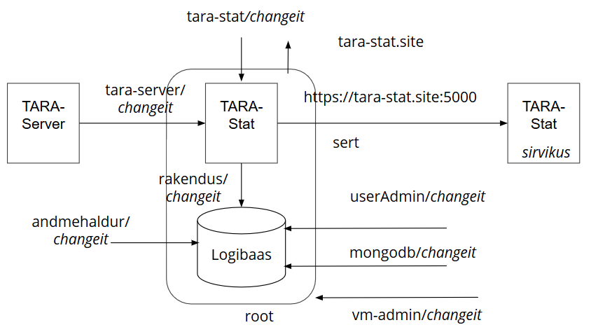

# Mikroteenus TARA-Stat
{: .no_toc}

dokumentatsioon

## Sisukord
{: .no_toc}

- TOC
{:toc}

## Ülevaade

TARA-Stat on mikroteenus [autentimisteenuse TARA](https://e-gov.github.io/TARA-Doku) kasutusstatistika tootmiseks ja vaatamiseks.

TARA-Stat pakub:

- võimalust autentimisteenuses fikseeritud autentimistoimingute logimiseks, hilisema statistikaarvutamise tarbeks
- võimalust logi põhjal lihtsa - kuid autentimisteenuse haldamiseks vajaliku - statistika arvutamiseks ja vaatamiseks

Eelkõige huvitab autentimiste arv klientrakenduste lõikes ajaperioodil.

TARA-Stat kasutajaliides statistikakasutajale:

<p style='text-align:center;'></p>

## Komponendid ja liidesed

TARA-Stat koosneb kahest komponendist ja neljast liidesest.

| komponent | otstarve |
|-----------|----------|
| veebirakendus | Node.js rakendus, mis ühelt poolt võtab vastu logikirjed ja salvestab need logibaasi. Teiselt poolt arvutab kasutusstatistika ja esitab seda statistikakasutajale. Koosneb omakorda serveripoolsest osast ja  kasutaja sirvikusse laetavast osast |
| logibaas | MongoDB andmebaas, kus salvestatakse logikirjeid |

| liides    | otstarve |
|-----------|----------|
| logikirje lisamise liides (otspunkt) | HTTPS REST JSON otspunkt, mille kaudu TARA-Stat võtab TARA-Server-lt vastu logikirjeid |
| statistika väljastamise  (otspunkt) | HTTPS veebiliides, mille kaudu statistikakasutaja tutvub kasutusstatistikaga |
| logibaasi haldamise liides | MongoDB käsureaklient, millega aeg-ajalt puhastatakse logibaasi aegunud kirjetest |
| elutukse liides | HTTPS otspunkt, millelt saab pärida kinnitust TARA-Stat elusoleku kohta |

### Logikirje lisamise otspunkt

Saata `POST` päring `https://<tara-stat>` (kus `<tara-stat>` on TARA-Stat-i domeeninimi), mille kehas on JSON kujul

```
{ 
  "aeg": <ISO date>,
  "klient": <klientrakenduse nimi>,
  "meetod": <MobileID,  ID_CARD, eIDAS vm meetod>
}
```

`ISO date` on ajatempel kujul `2018-04-28`, millele võib järgneda kellaaja osa.

#### Statistika väljastamise otspunkt (statistikakasutaja UI)

Statistikakasutaja sirvikus avada leht `https://<tara-stat>` (kus `<tara-stat>` on TARA-Stat-i domeeninimi).

Määrata periood (võib jääda ka tühjaks)
- sisestades regulaaravaldise
- nt `2018-04` valib 2018. a aprilli logikirjed
- vajutada nupule
- kuvatakse autentimiste arv perioodi jooksul klientrakenduste lõikes

#### Elutukse otspunkt

Päringu `https://<tara-stat>/status` saamisel kontrollib TARA-Stat oma logibaasi ülevalolekut. Kui logibaas on üleval, siis tagastatakse HTTP vastus `200` `OK`,
- vastasel korral `500` `Internal Server Error`.

## Suhtluse osapooled

TARA-Stat suhtleb 5 välise osapoolega.

| väline osapool | selgitus |
|----------------|----------|
| statistikakasutaja | autentimisteenust TARA käitava organisatsiooni teenistuja - teenusehaldur või tootejuht- kes vajab teavet teenuse kasutamise mahu, sh trendide kohta. Statistikakasutajale tuleb pakkuda statistikat. Eriti vajalik on teave teenuse tarbimismahtudest klientrakenduste lõikes. Statistikakasutajal peab olema võimalik ette anda periood, mille kohta statistika arvutatakse. Statistikakasutajal ei tohi olla võimalust logi muuta.<br><br>Kuna statistika on üldistatud ega sisalda isikuandmeid, lähtume statistika otspunkti turvamisel, et otspunkt on avatud organisatsiooni sisevõrgus, kõigile töötajatele. |
| TARA-Server | saadab TARA-Stat-i logikirjeid. TARA-Server võib olla paigaldatud mitmes instantsis. |
| andmehaldur | inimene, kes, kasutades MongoDB standardvahendeid - käsurealiidest `mongo` - kustutab logibaasist aegunud kirjeid. (Kasutusstatistika pakub huvi u aasta jooksul). See on harv tegevus. |
| admin on inimene, kes paigaldab tarkvara, loob andmebaasi kasutajatele (TARA-Server, andmehaldur) kontod ja annab pääsuõigused. |
| monitooringusüsteem saab TARA-Stat-le saata "elutuksepäringu". TARA-Stat vastab, kas ta toimib. |

## Paigaldamine

TARA-Stat kood paiguta kausta paigaldusskriptidega. Seejuures on vaja ka käsitsi tegevusi.

Järgnevas eeldame, et:
- virtuaalmasin (VM) on loodud
- Ubuntu 16 LTS on paigaldatud
- paigaldaja (admin) on sudo-õigustega kasutajana sisse loginud. 

Alusta paigaldamist TARA-Stat koodi paigaldamisega koodirepost VM-i. Järgnevas eeldame, et TARA-Stat kood asub GitHub-is, kuid võib olla ka siserepos.

Paigalda TARA-Stat kood kausta `/opt/TARA-Stat`.

`sudo rm -R TARA-Stat` (kustuta vana) (valikuline)
`sudo git clone https://github.com/e-gov/TARA-Stat` 

Seejärel leiad koodirepo kaustast `/opt/TARA-Stat/scripts` paigaldusskripte, millega saad edasist tööd automatiseerida.

Edasiarendusvõimalusena võib kaaluda paigaldusskriptide põhjal Jenkinsi paigalduskonveieri ehitamist.
{: .adv}

Paigaldusskriptid. Paigaldamisel saad kasutada järgmisi skripte:

| paigaldusskript | ülesanne |
|--------|----------|
| `TARA-Stat-paigalda-Nodejs.sh` | paigaldab Node.js |
| `TARA-Stat-paigalda-MongoDB.sh` | paigaldab MongoDB ja seadistab logibaasi |
| `TARA-Stat-seadista-rakendus.sh` | seadistab veebirakenduse |
| `TARA-Stat-diagnoosi.sh` | väljastab diagnostilist teavet paigalduse kohta |

Skriptid asuvad koodirepo kaustas `/opt/TARA-Stat/scripts`.

Esmakordne paigaldamine. Valmista VM ja paigalda Ubuntu (16 LTS server).

1\. täida `TARA-Stat-paigalda-kood.sh`
2\. täida `TARA-Stat-paigalda-Nodejs.sh`
3.\ täida `TARA-Stat-paigalda-MongoDB.sh` (2. ja 3. järjekord ei ole oluline)
4\. täida `TARA-Stat-seadista-rakendus.sh`

`TARA-Stat-diagnoosi.sh` võib käivitada igal ajal; see skript ei muuda paigaldust.

Tarkvarauuenduse paigaldamine. Kui tarkvarauuendus ei puuduta Node.js ega MongoDB-d, siis piisab 1. ja 4. sammu läbitegemisest. Täpne juhis, kas võimalik on osaline uuestipaigaldamine, peab kaasas olema konkreetse tarkvarauuendusega.

Väikese tarkvarauuenduse puhul on võimalik ka värskenduste tõmbamine repot üle kirjutamata:

`git pull origin master` (kaustas `TARA-Stat`)

Enne seda tuleb aga teha

`git checkout .`

sest kuna rakenduse seadistamisel on `config.js` muudetud, siis pull-i tegemisel tekib muidu konflikt.

## Käivitamine, staatus ja seiskamine

Nii TARA-Stat veebirakendus kui ka MongoDB käitatakse systemd hallatavate teenustena`. 

|    | TARA-Stat veebiteenus | MongoDB (logibaas) |
|----|-----------------------|--------------------|
| systemd teenusenimi | `tara-stat` |  `mongodb`  |
| käitav Ubuntu kasutaja | `tarastat` | ´mongodb` |

Teenused käivitatakse ja seisatakse standardsete `systemctl` käskudega, nt:

`systemctl start mongodb`
`systemctl status mongodb`
`systemctl stop mongodb`

Teenuste käivitamise järjekord ei ole oluline.

**TARA-Stat ülevaloleku lõppkontroll**. Ava sirvikus `https://tara-stat-<site>:5000`. Rakendus teatab, et ühendus ei ole turvaline. See on tingitud self-signed serdist. Aktsepteeri turvaerind. Ilmub rakenduse avaleht.

## Olulised asukohad

|            | MongoDB   | TARA-Stat |
|------------|-----------|-----------|
| konf-ifail | `/etc/mongodb.conf` | `/opt/TARA-Stat/config.js` |
| logi       | `/var/log/mongodb/mongod.log` | `/opt/TARA-Stat/log.txt` |
| andmebaasifailid | `var/lib/mongodb` |  |
| systemd haldusüksuse kirjeldusfail | `/lib/systemd/system/mongod.service` | `/lib/systemd/system/tarastat.service` |
| automaatkäivitusskript | `/etc/init.d/mongodb` | |

## Diagnostika

| teade v käitumine | võimalik põhjus |
|--------------|------------------|
|  `connection refused` | rakendus on maas |
| `Logibaasiga ühendumine ebaõnnestus' | MongoDB on maas |

## Logi

- MongoDB andmebaasilogi asub: `/var/log/mongodb/mongod.log`
- Node.js- endal logi ei ole
- Veebirakendus logib faili, mille asukoht vaikimisi on `/opt/TARA-Stat/log.txt`. Logifaili asukoht on veebirakenduse konf-ifailis seatav.

## Testimine

**mini.js**. Tarkvara koosseisus on lihtne vahend HTTP ja HTTPS ühenduste testimiseks:
- `mini.js` - loob minimaalse HTTP ja HTTPS serverid, mis kuulavad portidelt 5001 ja 5000.
- `scripts/seadistaMini.sh` - paigaldab ´mini.js` systemd veebiteenusena.

**mockup.js** on eraldi VM-i paigaldatav lihtne Node.js rakendus, mis etendab logikirjeid TARA-Stat logibaasi saatvat TARA-Server-it. Programmi juurde kuulub konf-ifail `mockup-config.js`.

Testimisvahendeid toodangus ei kasutata. Neid võib repos sisuga koos tootmismasinasse kopeerida, kuid neid ei ole vaja (ega tohigi) skriptidega ega muul viisil aktiveerida.

## Sõltuvused

Tootmissõltuvused:

| sõltuvus | versioon | selgitus, sh milleks vajalik |
|----------|----------|-----------------|
| backend: | | |
| Ubuntu   | 16 LTS   | suure tõenäosusega sobib ka hilisem |
| Node.js  | 6.x      | veebirakendus   |
| body-parser | standardne | veebirakendus |
| ejs         | standardne | veebirakendus |
| express | standardne | veebirakendus |
| mongodb | standardne | MongoDB klient, veebirakendus |
| request | standardne | veebirakendus |
| basic-auth | standardne | veebirakendus |
| request-debug | standardne | veebirakendus |
| MongoDB  | 3.6.4 | logibaas |
| frontend: | | |
| HTML5, Css3, Javascript | | |
| jQuery | | |
| Material Design ikoonid | | |

Arendussõltuvused
| GitHub | | avalik koodirepo |
| Jekyll | | avaliku dok-ni publitseerimine |

- "standardne" tähendab laialt kasutatavat, stabiilset teeki, millest `npm` abil paigaldatakse viimane versioon.
- kui versioon on tühi, siis kasutatakse standardseid võimalusi, mis ei nõua sidumist konkreetse versiooniga.

## Konfigureerimine

Konfigureeritakse järgmiste failidega:

| fail | eesmärk ja kasutamine |
|------|-----------------------|
| `config.js` | veebirakenduse konf-n |
| 

## Turvamine

TARA-Stat-is on rakendatud järgmised turvevalikud.

- Omaette VM. TARA-Stat paigaldatakse eraldi VM-i. VM-is ei ole teisi rakendusi. 
- Ainult sisevõrgus. Mikroteenus on ligipääsetav ainult organisatsiooni sisevõrgus.
- API kaitse võti. Logikirje lisamise otspunkt kaitstakse API võtmega (salasõnaga). API võti paigaldatakse TARA-Serverisse ja pannakse kaasa igas päringus logikirje lisamise otspunkti poole. Statistika väljastamise otspunkt API võtmega kaitset ei vaja, kuid on ligipääsetav ainult organisatsiooni sisevõrgus. Elutukse otspunkt on ligipääsetav ainult organisatsiooni sisevõrgus.
- HTTPS. Veebirakendus API-s ainult HTTPS.
- Andmebaasikasutaja autentimine. Veebirakendus pöördub MongoDB poole eraldi andmebaasikasutajana (`rakendus`). Andmebaasikasutaja autenditakse. Kasutusel on MongoDB vaikimisi autentimismehhanism - soolaga salasõna põhine.
- Rollipõhine pääsuhaldus andmebaasis. Admin on eraldi andmebaasikasutaja.
- Veebirakenduse ja MongoDB suhtluses ei rakendata TLS-i. Kuna andmebaas suhtleb ainult samas masinas oleva rakendusega ja masinas ei ole teisi rakendusi, ei ole TLS-i hädavajalik.
- Aandmebaasi ei krüpteerita, kuna konfidentsiaalsusvajadus ei ole kõrge.
- Nii veebirakendus kui ka MongoDB käitatakse eraldi, spetsiaalsete kasutajate alt (`tarastat` ja ´mongodb´).
- Ligipääs andmebaasile (kirjutamine) on kaitstud ka failisüsteemi õiguste tasemel.
- Andmebaasi võrgus nähtavuse piiramine. Andmebaas ei ole nähtav VM-st väljapoole. Andmebaasi kasutab ainult samas masinas asuv veebirakendus. 
- Andmebaasi auditilogi ei peeta, kuna terviklusvajadus ei ole nii kõrge.

Vajadusel vt taustaks:
- MongoDB [turvakäsitlus](https://docs.mongodb.com/manual/security/) sisaldab [turvameelespead](https://docs.mongodb.com/manual/administration/security-checklist/) rea soovitustega.

## Identiteedid ja kredentsiaalid

Osapooltel on identiteedid (nimed), mida tõendavad kredentsiaalid (paroolid, võtmed).

TARA-Stat käitluskontekstis on 9 osapoolt (subjekti), kes vajavad identiteedi ja kredentsiaalide andmist ning õiguste seadmist.

| kasutaja vm õiguste subjekt (_principal_), masinloetava nimega | subjekti liik ja kirjeldus | kredentsiaalid |
|:--------:|:-------:|:--------------:|
| `admin` | Ubuntu kasutaja, kes paigaldab tarkvara ja teeb muid haldustoiminguid | salasõna |
| `tarastat` | Ubuntu kasutaja, kelle alt käivitatakse TARA-Stat veebirakendus | salasõna |
| `mongodb` | Ubuntu kasutaja, kelle alt käitatakse Mongo DB andmebaas | 
| `userAdmin` | MongoDB kasutaja, kes haldab MongoDB kasutajaid. Seda rolli täidab VM admin | salasõna |
| `rakendus` | TARA-Stat veebirakenduse konto MongoDB-s | salasõna |
| `andmehaldur` | MongoDB konto, mille alt kustutatakse aegunud logikirjeid. Andmehalduri rolli täidab VM admin | salasõna |
| `https://tara-stat.site` | TARA-Stat veebirakendus | _self-signed_ sert |
| - | statistikakasutaja - anonüümne inimene, kes pöördub sisevõrgust TARA-Stat veebirakenduse statistika väljastamise otspunkti poole | - (ei autendita, juurdepääs piiratakse kontekstiga) |
| `tara-server` | TARA-Server, pöördub TARA-Stat logikirjete vastuvõtmise otspunkti poole | API kasutajanimi ja salasõna |

<p style='text-align:center;'></p>