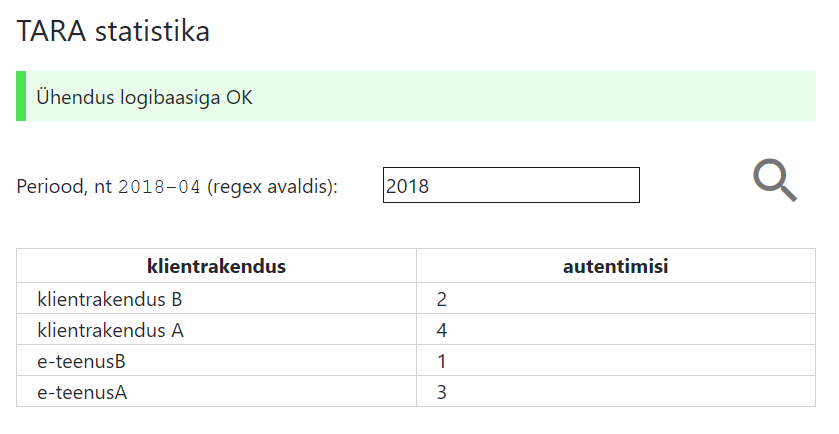

# Mikroteenuste arhitektuuri poole
{: .no_toc}

2\. päev, 30.04.2018

- TOC
{:toc}

Käesolevast kirjutisest võiks saada mikroteenuste _primer_ (aabits). Praegu on see aga kirjeldus ühe mikroteenuse tegemisest.

Esimeses jaotises analüüsin mikroteenuse (µT) vajadust ja üldisi omadusi.

Teises jaotises spetsifitseerin ja dokumenteerin üht konkreetset µT-t (TARA-Stat). Eesmärk on teha ise protsess otsast lõpuni läbi.

Kolmandas jaotises on viiteid kasutatud tehnoloogiate kohta.

## 1. Vajadus ja väljakutse

Monoliitrakenduse arendamine ja paigaldamine on tüüpiliselt pikk ja vaevaline protsess. Miks see nii on? Raskused on osalt objektiivsed, sest kvaliteedi- ja turvanõudeid on palju ja neid ei saa ignoreerida. Monoliitrakendusi mikroteenustega asendades peaksime vältima, et töömaht ei multiplitseeruks. Mikroteenus ei tohiks olla samaväärne andmekoguga - kogu sellest tuleneva arendus- ja haldusbürokraatiaga. Samas peavad kõik olulised kvaliteedi- ja turvanõuded olema täidetud ka mikroteenuste puhul. See on võib-olla suurim väljakutse.

### 1.1 Kontekst

Meil ei jätku inimesi, kes kõik vajalikud e-teenused välja arendaks, olemasolevaid uuendaks ja innovatsiooni sisse tooks. See paneb otsima võimalusi IT-d senisest teistmoodi teha. Nagu iga keerulise probleemiga, on probleemi raske sõnastada. Puudu ei ole inimestest, vaid ... aga milles täpselt on probleem? Avaliku sektori IT on keeruline, aeganõudev ja kohmakas. Tuleb lisada, et sageli ka tehnoloogiliselt vananenud.

Süsteemide ehitamisest koosnevana mikroteenustest räägitakse IT-maailmas praegu palju. Mida mikroteenus annab? Kirjandusest ei saa selget pilti. Seetõttu teeme protsessi ise läbi ja üritame mikroteenuste plusse ja miinuseid kogemuse põhjal hinnata.

Kontekstiks on keskmine või suurem organisatsioon, kes haldab oma IT-taristut. Taristust teame niipalju, et seal töötab palju mitmesuguseid süsteeme, rakendatakse virtualiseerimist. Tehnoloogiate poolest palju selliseid, mis tüüpilised sama suurusega organisatsioonidele. Nagu igal pool, on aktuaalne IT automatiseerimine, sest inimesi kõige vajaliku ärategemiseks napib. Turvanõuete poolest on süsteemid erinevad, kuid üldiselt on turvanõuded kõrged.

### 1.2 Mikroteenus

Mikroteenus (µT) on iseseisva elutsükliga, kiiresti arendatav, selgepiiriliste liidestega, iseseisev, ühte kasulikku funktsiooni täitev rakendus.
{: .note}

**Iseseisva elutsükliga**. Mida see tähendab? µT arendus ei pea käima süsteemi teiste osade arendusega ühte jalga. µT tehakse valmis ja pannakse tööle. Muudetakse siis, kui on vaja.

**Kiiresti arendatav**. See on väga tähtis omadus. µT peaks olema arendatav u nädalaga. Vajadusel äravisatav ja nädalaga uuesti kirjutatav. Miks äravisatavus ja ümberkirjutatavus on tähtis? Sest sellega leevenevad või langevad hoopis tahaplaanile monoliitsüsteemide puhul üliolulised küsimused nagu programmeerimiskeelte, raamistike, teekide ja tehnoloogiate valik. Nende valikule kulutatakse meeletult aega ja sageli pannakse ka mööda. Monoliitsüsteemi puhul tähendab mõne komponenttehnoloogia väljavahetamine enamasti terve süsteemi ümberkirjutamist. Kiiresti arendatavusel on ka palju teisi häid omadusi.

**Selgepiiriliste liidestega**. Liidesed tuleb hoida võimalikult lihtsad ja kompaktsed. Suhtlus teiste komponentidega peab toimuma võimalikult laialt levinud, universaalses keeles. Tänapäeva universaalne liidesekeel REST stiilis HTTP(S) protokoll, andmete edastusega JSON-s. (See ei tarvitse nii jääda, sest keeled arenevad. Vt nt [JSON-RPC](http://www.jsonrpc.org/)).

**Iseseisev**. Iseseisvus tähendab võimalikult väheseid sõltuvusi (_dependencies_). Mitte ainult sõltuvused teistest (mikro)teenustest, vaid ka kasutatavatest teekidest, raamistikest jm tehnoloogiatest. 

µT sõltuvuste arv peab olema väike. Iga liides on sõltuvus. Iga kasutatav teek, tehnoloogia või arendusvahend on samuti sõltuvus.
{: .adv}

Sõltuvuseks võib olla ka liiga keerukas arendusprotsess.
{: .adv}

Miks see on oluline? Kuigi µT on äravisatavad ja ümberkirjutatavad, on siiski kasulik neid aeg-ajalt täiendada. µT arendus ei tohiks olla pidev. Kergem on meelde tuletada ja muuta koodi, mis on kirjutatud laialt levinud keeles.

**Ühte kasulikku funktsiooni täitev**. Ühe funktsiooni tõttu langevad ära või lihtsustuvad mitmed monoliitarenduses palju aega ja energiat nõudvad tööd. Vaja ei ole spetsiaalset süsteemi kasutusjuhtude kirjelduste haldamiseks - kasutusjuhtusid ongi 2-3. 

### 1.3 7 päeva

µT peaks olema (ümber-)kirjutatav u nädalaga.
{: .adv}

Milliste tööde ja toimingute vahel see aeg jaguneb? Koodi kirjutamine on ainult osa arendusest. Arendust mõistame siin DevOps vaatenurgast. S.t arendus on kõik see, mis ei ole teenuse käitamine. Arendamine on ka tarkvara paigaldamine. Planeerin järgmise ajakava:

päev    | töö                | tulemus  | edenemine   |
--------|--------------------|----------|:-----------:|
1\.     | arenduskeskkonna ülesseadmine,  koodi kirjutamine  | repo loodud, teegid ja tehnoloogiad valitud, vähemalt üks otspunkt teostatud | OK |
2\.     | koodi kirjutamine (jätk) | kõik otspunktid teostatud, äriloogika põhiosas teostatud (v.a nt turvakontrollid); arendaja masinas töötab; testitud käsitsi | OK |
3\.     | API spetsifikatsiooni jm dokumentatsiooni kirjutamine | µT API ja muu dok-n koostatud ja rahuldavas seisus | OK |
4\.     | paigaldusprotsessi ja -plaani koostamine, paralleelselt tarkvara viimistlemine, eriti turvalisuse tõstmise seisukohalt (_hardening_) | paigaldusplaan | |
5\.     | testpaigalduse läbitegemine; paralleelselt tarkvara viimistlemine, eriti turvalisuse tõstmise seisukohalt (_hardening_) | paigaldamine läbi mängitud | |
6\.     | toodangusse paigaldamine, klientide teavitamine | µT on kasutusvalmis; klientidele on teenust esitletud | |

### 1.4 Mikroteenuste turvalisus

Kõik olulised turvanõuded tuleb täita ka µT puhul. See on tõsine väljakutse, sest "vahemaa" µT-te vahel on suurem ja usalduse loomine ning kontrollimine nõuab lisameetmeid. Monoliitrakenduses pannakse kõik komponendid ühte patta kokku. "Ühes pajas" on komponentide identimine, autentimine ja ühenduste turvamine kas triviaalne või vähemalt palju lihtsam kui µT puhul. µT-d suhtlevad üle võrgu. Seetõttu on vaja võrguliiklust kaitsta.

Olukorda teeb ainult mõnevõrra lihtsamaks asjaolu, et µT-l võib puududa suhtlus organisatsioonist väljapoole. Ka sisevõrgus on vaja suhtlevaid osapooli autentida, reguleerida pääsuõigusi ja kaitsta andmete transporti.

Keskendumegi siin järgmistele turvalisuse küsimustele: suhtlevate osapoolte autentimine, pääsuõiguste reguleerimine ja andmete transpordi kaitse.

#### 1.4.1 Turvakontekst

µT kaitsmisel on oluline selgitada välja µT tegutsemise **turvakontekst**. Turvakonteksti määratleme siin kui µT paigaldus- ja kasutusümbrusest tulenevaid nõudeid µT turvalisusele.

Turvakontekst ja sellest tulenevad turvaeesmärgid ning -nõuded on olulised mitte sellepärast, et keegi tahaks - mingist abstraktsest ühtlustamise ideest lähtudes - kehtestada nõudeid nõuete pärast.

Eespool sai märgitud, et isoleerimine ei saa kunagi olla täielik. (Krüptograafia terrminites - mingi kõrvalkanal (_side channel_) jääb alati). Seetõttu tuleb arvestada, et ka suhteliselt madala ohuprofiiliga µT, olles IT-taristu üks osa, võib potentsiaalselt - kui turve jäetakse hooletusse - mõjutada teisi, hoopis tähtsamaid süsteeme.

Peamised põhjused on vajadus takistada võimaliku ründaja edasipääs teistesse süsteemidesse, samuti takistada tõrgete levik taristu teistesse osadesse.

Ründajal ei tohi olla võimalus kasutada rakendust lävepakuna IT-taristu teistesse osadesse.
{: .adv}

Rakenduse võimalike tõrgete levik IT-taristu teistesse osadesse peab olema tõkestatud.
{: .adv}

Hea näide on allpool käsitletav µT TARA-Stat. TARA-Stat on kasutusstatistika kogumise ja esitamise rakendus. TARA-Stat turvanõuded ei ole eriti kõrged. Isikuandmeid ei töödelda ja juhtimisotsuste tegemiseks - milleks TARA statistikat vaja on - ei ole statistika täpsus eriti oluline. Kuid see ei tähenda, et TARA-Stat turvamine oleks väheoluline. TARA-Stat paigaldatakse organisatsiooni IT-taristusse (arvutivõrku).

TARA-Stat turvakonteksti võime sõnastada järgmiselt: kuna µT paigaldatakse taristusse, kus võivad töötada teised, väga olulised teenused ja süsteemid (nt Valimiste infosüsteem - me ei taha, et potentsiaalseltki ründaja saaks µT kaudu sellele ligi), siis tuleb µT hoolikalt isoleerida ja ühendada ainult vajalike teiste teenustega. Samuti peab ligipääs µT kasutajaliidesele olema ainult inimkasutajatele, kes teavet vajavad.

#### 1.4.2 Isoleerimine

Organisatsiooni IT-taristu on suur ja keerukas. Taristu turbe üks tähtsamaid meetodeid on rakenduste **isoleerimine** e eraldihoidmine.

Isoleerimise mõiste on paremini arusaadav, kui mõtleme tavaliselt (veebi)sirvikust nagu Chrome või Firefox. Sirvikus jookseb mitmeid rakendusi ja sirviku ülesanne on need eraldi hoida. See tähendab, et rakendusel ei tohi olla mingit võimalust mõjutada teisel sakil või teises aknas töötavat teist rakendust - ega tohi teadagi teistest sirvikusse laetud veebilehtest. Ja uut lehte tohib laadida ainult lähtedomeenist (samaallikapoliitika, _Same Origin Policy_).

Rakendused isoleeritakse mitmel tasandil: masina, rakenduse, süsteemi, alamvõrgu, kogu IT-taristu tasandil.

Isoleerimine peaks olema lahendatud süsteemselt, kõiki taristukihte läbivalt. See on väljakutse igasuguste rakenduste, nii µT kui ka monoliitide puhul, sest ühel inimesel on raske tunda kõiki kihte. Kui aga erinevates taristukihtides lahendavad turvaprobleeme erinevad inimesed, siis terviku kokkusobitumiseks peavad nad tegema koostööd - ja selle eeldusena - olema võimelised üksteisest aru saama.

Ei ole _overkill_ kasutada OSI kihimudelit, võib-olla valides sealt relevantsed kihid ja lisades vastavalt vajadusele lisakihte. Üldistatult on kaks kihti e tasandit: rakenduse tasand ja võrgu tasand. Detailsemalt võiks eristada nelja kihti:
- rakenduse kiht
- protokolli kiht
- võrgu kiht (OSI layer 3)
- andmeühenduse tasand (OSI layer 2).

#### 1.4.3 Autentimine

Rakenduse tasandil on suhtluse osapoolte autentimiseks mitu võimalust:

- sümmeetriline võti (salasõna)
  - rühma võti
  - individuaalne võti
- asümmeetriline võtmepaar
  - ise tõendatud (_self-signed_)
  - sertifitseerimisteenuse poolse tõendamisega (CA)
    - organisatsiooni enda CA
    - väline CA
- autentimisteenus (_trusted third party_).

**Sümmeetriline võti** e salasõna (_secret_), on sõne vm väärtus, mida teavad suhtluse mõlemad osapooled (ja ainult nemad) (vähemalt võtmevahetuse etapil - hiljem võib üks osapool hoida salasõna räsi). Pöörduja paneb salasõna päringusse kaasa. Masinliidese puhul nimetatakse API võtmeks (_API Key_), Inimliidese puhul parooliks. Salasõna on lihtne, järeleproovitud lahendus väikese arvu suhtlevate osapoolte korral. 

**Asümmeetrilise võtmepaari** puhul on kasutusel kaks üksteisega krüptograafiliselt seotud võtit - avalik ja privaatvõti. Privaatvõtme omanik edastab teisele osapoolele ainult avaliku võtme. Osapool tõendab oma identiteeti, allkirjastades sõnumi oma privaatvõtmega. Ühtlasi tagatakse sõnumi muutumatus transpordil.

Asümmeetrilise võtmepaari kasutamisel on kaks varianti avaliku võtme edastamiseks. Isetehtud sertifikaadi (_self-signed certificate_) korral genereerib avaliku võtme tõendi (sertifikaadi) privaatvõtme omanik ise. Sertifikaadid esitatakse tavaliselt X.509 võtmevormingus.

Osapoolte suure arvu puhul on otstarbekas kasutada **sertifitseerimisteenust** (Certification Authority, CA). Organisatsioon võib oma tarbeks pidada sertifitseerimisteenust ise (_enterprise CA_) või kasutada väliste CA-de teenuseid.

**Autentimisteenuse** (_trusted third party_) kasutamisel delegeeritakse autentimine välisele (kolmandale), usaldatavale osapoolele. Autentimist vajav osapool suunatakse autentimisteenusesse, kus tema identiteet kindlaks tehakse. Osapool esitab autentimisteenuse poolt väljaantud tõendi (_bearer token_). Kontrolliv osapool võib ka ise pöörduda autentimisteenuse poole kinnituse saamiseks. Levinud _trusted third party_ protokollid on OAuth 2.0, OpenID Connect ja SAML.

Autentimisskeemi valik sõltub suhtluspartnerite arvust ja stabiilsusest ning kas suhtluspartnerid kuuluvad ühe ja sama või erinevate organisatsioonide haldusalasse.

Võtmeküsimus (_pun intended_) on kes kannab võtmehalduse kulu või sertifitseerimis- või autentimisteenuse osutamise kulu. CA teenused pole tasuta ja ka organisatsiooni enda CA pidamine on kulu.

µT puhul, mis pakub masinliidest väikesele arvule, kindlatele partneritele, võiks kasutada sümmeetrilist API võtit.

Turvalisust ei saa tasuta. Juurdepääsu piiramist vajava API korral ei pääse võtmehaldusest või välise autentimis- või sertifitseerimisteenuse ostmisest.
{: .adv}

Võrgu tasandil saab samuti autentida, kontrollides teise osapoole IP-aadressi. Kuid  tavaliselt ei loeta seda piisavaks. Osapoole (siis rakenduse) IP ei tarvise olla piisavalt püsiv. Samuti peetakse IP-aadresside võltsimist (_IP spoofing_) teatavaks ohuks.

Kokkuvõttes, autentimine on alati kulu. Sellest kulust saab vabaneda ainult siis, kui autentimine pole vajalik s.t teenust saab osutada anonüümsele kasutajale. Pääsu piiramise vajadus võib siiski olla ka anonüümteenuse korral. Sellest järgmistes jaotistes.

#### 1.4.4 Võrgule avatuse piiramine

Üks peaeesmärke on **piirata võrgule avatust** (_Network Exposure_). Selleks tehakse seadistustoiminguid võrguseadmetes, võrku ühendatud masinates ja võrgutarkvaras.

Masina tasandil piiratakse võrguliiklust masina ja välismaailma vahel. Seda tehakse Linux-i tulemüüri (iptables) seadistamisega (vt nt [Linux-i tulemüüri algaja juhend](https://www.howtogeek.com/177621/the-beginners-guide-to-iptables-the-linux-firewall/)). Windows-is on analoogiline võimalus (Netsh).

Ruuteri tasandil piiratakse võrgu piiril toimuvat liiklust.

Virtuaalse kohtvõrgu (_Virtual LAN, VLAN_) tasandil määratakse, millised masinad pannakse kokku ühte virtuaalsesse kohtvõrku.

#### 1.4.5 Pääsu jagamine

Meeldib see meile või mitte, kuid oluliste tagajärgedega toiminguid saavad teha ainult vastavate volitustega isikud. Standardne mehhanism on rollipõhine pääsuhaldus (Role-Based Access Control, RBAC) ja sellest pääseme ainult siis, kui µT on tõeliselt _single purpose_ s.t ongi ainult üks toiming. µT-ses endas ei ole rollihalduse teostamine otstarbekas ega mõeldavgi. µT-ses endas peaks olema ainult autenditud kasutaja rolli kontrollimine. Rollide omistamine ja äravõtmine peaks käima väljaspool. 

µT tavaliselt ei suuda ise teha rollihaldust, vaid vajab seda teenusena.
{: .adv}

#### 1.4.6 Ühendamine

Eraldamine ei ole siiski kunagi absoluutne. Veebisirviku näites oleksid veebilehed väga primitiivsed kui veebileht suhtleks ainult oma serveripoolega. **Ühendamine* on isoleerimise vastandprotsess. Koos moodustavad need dialektilise terviku, omamoodi yingi ja yangi. Samas sirvikus töötavate veebirakenduste ühendamiseks ongi loodud erinevaid võimalusi: allikavaheline ressursijagamine, _Cross Origin Resouce Sharing_ (_CORS_), postMessage API, vanematest JSONP.

#### 1.4.7 Transpordi turvamine

Monoliitrakenduses ei ole komponentidevahelise andmeedastuse turvamine probleem. Üks Java meetod kutsub välja teist. Kõik see toimub Java virtuaalmasina (JVM) sees. Eeldame, et JVM-s keegi pealt ei kuula ega vahele ei sekku. _That's it_. µT-sed aga on paigaldatud igaüks eraldi ja seetõttu peavad suhtlema üle vähem või rohkem ebaturvalise võrgu.

µT peaks suhtlema turvatud protokolli kaudu. Levinuim protokolli selles suhtluses on HTTP. 

µT-l peaks olema HTTPS võimekus.
{: .adv}

## 2. TARA-Stat

### 2.1 Funktsioon

TARA-Stat on eksperimentaalne µT [autentimisteenuse TARA](https://e-gov.github.io/TARA-Doku) kasutusstatistika tootmiseks ja vaatamiseks. Olemas on varem koostatud spetsifikatsioon: [TARA kasutusstatistika](https://e-gov.github.io/TARA-Doku/Statistika).

TARA-Stat pakub:
- võimalust autentimisteenuses fikseeritud autentimistoimingute logimiseks, hilisema statistikaarvutamise tarbeks
- võimalust logi põhjal lihtsa - kuid autentimisteenuse haldamiseks vajaliku - statistika arvutamiseks ja vaatamiseks
  - eelkõige huvitab autentimiste arv klientrakenduste lõikes ajaperioodil

Ongi kõik. Kohe tekib küsimus, kas seda pole liiga vähe? See µT on spetsialiseeritud logi. Logimine on ulatuslik teema. Logitakse mitmel erineval eesmärgil - turvamine, kasutajate pöördumiste lahendamine, teenuse ülaloleku seiramine jm. Autentimisteenuses TARA on juba oma, keerukas logilahendus - mis on (potentsiaalselt) ühendatud võimsa keskse logisüsteemiga. Kas siis eraldi, spetsialiseeritud logilahendusel on mõtet? See on mittetriviaalne, kuid väga oluline küsimus. Eraldi logilahendusel puuduks mõte, kui olemasolev võimas, väga paindlik ja paljude omadustega, _out-of-the-box_ logisüsteem oleks seadistatav vajaduse lahendamiseks vähema ajaga kui kulub µT arendamiseks. Praktika näitab siiski, et võimsate universaallahenduste tundmaõppimine ja seadistamine võib olla väga töömahukas. Ise tehes saame teha täpselt selle mida vajame - täpselt nii nagu tahame. Küsimusele kumb on parem - kas ise tehtud µT või seadistatud võimas universaalne vahend - ei ole universaalset vastust. Ise põlve otsas tegemine nõuab oskusi ja on kahtlemata riskantne. Kuid reaalsed riskid on ka suurte universaalsete valmislahenduste puhul. Näeme ju praktikas ikka ja jälle, kuidas majja tuuakse ilus ja võimas raamistik, meetod või keel, kuid selle juurutamine võtab aastaid ning suur osa vahendi võimalustest jäävad kasutamata. Igal juhul oleme µT puhul oma kahjusid tõkestanud - äraviskamisel kaotame maksimaalselt ühe nädala töö. Kui arvestada õppimist, siis tõenäoliselt vähem.

µT peab täitma ühtainust ülesannet (millel võib olla mitu tahku v osaülesannet).
{: .adv}

### 2.2 Komponendid

µT- sisestruktuur peab olema lihtne. µT TARA-Stat koosneb kahest komponendist ja neljast liidesest.

Komponendid:
- rakendus
  - serveripoolne osa
  - kasutaja sirvikusse laetav osa
- andmebaas.

Liidesed:
- logikirje lisamise liides
- statistika väljastamise liides
- logibaasi haldamise liides
- elutukse liides.

### 2.3 Olek

Vahel seatakse tingimuseks, et µT ei tohi hoida olekut (_state_). Minu meelest see ei ole põhjendatud. Olekuta (_stateless_) µT oleks pelgalt teisendaja (vrdl Amazon pilve lambda-funktsioon). Kusagil peab olekut hoidma ja kui lööme äriloogika µT-teks, oleku aga viskame kõik ühte PostgreSQL andmebaasi, siis see viib minu meelest tagasi monoliitlahenduse suunas. Kesksel andmebaasil on suured eelised, eelkõige sünkroonimise probleemi lahendamises. Vägisi pealesunnitud keskne andmebaas võib siiski olla ainult näiliselt efektiivne. Kui toetatav äriloogika olemuselt ongi hajus - s.t et süsteemi äriloogiline olek ei saagi olla igal ajamomendil kooskõlaline - siis on keskne sünkroonimine kunstlik ja raskesti tajutavaid probleeme tekitav. Iga süsteemi puhul ei sobi ka oleku hoidmine "kliendi poolel" (s.t sirvikus). 

Minu µT-stel võib olla ka olek (_state_) ja TARA-Stat puhul nii ongi. TARA-Stat olek ei ole keerukas. Olekuks on logi. Logikirjed on ühtse struktuuriga.

#### 2.3.1 Oleku hoidmise tehniline lahendus

Nii lihtsat andmestruktuuri võiks hoida tavalises logifailis. Siiski on TARA-Stat-is kasutusel andmebaasisüsteem (MongoDB). See on oluline otsus. Oleku hoidmise tehnoloogiavalikul olid alternatiivid:
- fail(id)
- PostgreSQL andmebaas
- MongoDB andmebaas.

Valik on tehtud arendaja (antud juhul mina ise) kompetentside ja eelistuste põhjal. Ka see on väga oluline moment. Monoliitsüsteemis on tehnoloogiate kombineerimine võimatu. Tehnoloogiavalikud tehakse üks kord, kõige ja kõigi jaoks. See on valuline protsess. Tihti saavad otsuse tegemisel määravaks hoopis kõrvalised asjaolud. MongoDB on suhteliselt uus, nn Non-SQL andmebaasitehnoloogia. MongoDB veebisait väidab, et nende süsteemi kasutamisel on elutsüklikulud 10 korda väiksemad kui relatsioonilise andmebaasi puhul. See on diskuteeritav. Praegu on ka küsimus, kas eraldi andmebaasisüsteemi kasutamine ühe µT puhul on õigustatud. Andmebaasisüsteem võimaldab ühes paigalduses hoida erinevaid andmebaase; need on üksteisest isoleeritud. Tõepoolest, aga siis peaks andmebaas olema pakutud teenusena (_Database as a Service_). (Näiteks sedasama MongoDB-d pakutakse ka pilveteenusena). Küsimus on teenuse kvaliteedis. Kui on olemas dokumenteeritud, usaldusväärne, kiirelt reageeriva kasutajatoega, mõistliku hinnaga, kergelt kasutatav (andmebaasi)teenus, siis muidugi ei ole mõtet hakata ise andmebaasi püsti panema. Praegu lähtume, et selliste omadustega teenust ei ole.

Andmebaasi teema juures tuleb märkida veel seda, et andmebaasi haldamine, sh jõudluse, andmete säilimise, kooskõlalisuse ja turvalisuse tagamine on suur töö. Praktiliselt nõuab see spetsialiseerumist- eraldi andmebaasiasjatundjat (DBA-d). Siin on kindlasti vastuolu, sest µT väike arendusmaht ei luba arendusmeeskonnas spetsialiseerumist (eriti kui arendusmeeskond ongi üks inimene).

TARA-Stat olek õnneks ei ole keerukas. Nõuded andmekvaliteedile ei ole ka väga kõrged. Statistika kvaliteet ei kannata, kui väike hulk logikirjeid peaks ka kaduma minema. Olukord võib siiski kiiresti muutuda, kui logi peaks hakatama kasutama klientidele arvete esitamiseks (_billing_). Siis peaks arvestus olema täpne.  

### 2.4 Programmeerimiskeel

TARA-Stat on kirjutatud Javascriptis. Täpsemalt, tehnoloogiapinu on järgmine (järgnev loetelu ei sisalda organisatsiooni IT-taristu spetsiifilisi tehnoloogiad - nende nimetamine ei oleks turvakaalustluste tõttu hea praktika):
- rakendus
  - serveripoolne osa
    - Node.JS
      - Express
      - MongoDB Driver
  - sirvikusse laetav osa
    - HTML5, CSS, Javascript
    - jQuery, Google Material Design ikoonis
- andmebaas
  - MongoDB
- avalik koodirepo 
  - GitHub  
- dokumentatsioon
  - Jekyll
- arendusvahendid
  - koodi kirjutamine
    - Visual Studio Code
  testimine
    - Visual Studion Code Debugger
    - [httpie](https://httpie.org/) - (HTTP käsureaklient. Kasulik REST API-de uurimisel ja silumisel. Väidetavalt parem kui curl.)

Tehnoloogiad on valitud kasinuse põhimõttel. Kasutatud (tehtud strateegiliste valikute raames) võimalikult standardseid vahendeid.

Ühes µT-s kasutatavate tehnoloogiate (teekide, keelte jms) hulka tuleb hoida kontrolli all. Valida tuleb ainult vajalikud, soovitavalt üldlevinud vahendid. Vahendid ei tohi olla lahendatava ülesande suhtes liiga "võimsad".
{: .adv}

Ühe µT sisetehnoloogiad ei tohi mõjutada teise µT sisetehnoloogiate valikut.
{: .adv}

Tehnoloogiate valimisel ei saa läbi katsetamiseta. Kulutasin omajagu aega [RESTHEart](http://restheart.org/) - MongoDB veebiliides s.o rakendus, mis ühendub MongoDB külge ja võimaldab REST API kaudu andmebaasi kasutada - uurimisele. Ühel hetkel sain aru, et lisalüli ei ole vaja ja lihtsam on  MongoDB veebiliides kirjutada ise, kasutades standardset MongoDB Node.JS draiverit. (See on väga tüüpiline. Internetis pakutakse palju raamistikke, vahendeid jms, mis on ehitatud teise vahendi peale ning nagu pakuksid lisaväärtust. Arvestades, et iga vahendit tuleb tundma õppida ja häälestada, on tihti kasulik sellistest kahtlast lisaväärtust pakkuvatest vahekihtidest loobuda ja programmeerida ise, standardsete vahenditega.)

### 2.5 Töö jätkamine teise arendaja poolt

Kas teine arendaja saab tööd TARA-Stat-ga jätkata? Usun, et jah, saab - kui ta tunneb µT-ses kasutatud võtmetehnoloogiaid või on valmis neid õppima. Praegusel juhul MongoDB ja Node.JS. (HTTP REST tundmist eeldan.) Koodi maht on väike - 200 LOC. See on kindlasti endale selgeks tehtav. Kasutatud on standardseid, laialt tuntud teeke. 

Kui arendaja peaks MongoDB või Node.JS mitte tudnma ega soovi neid õppida, siis tuleb TARA-Stat kood ära visata ja rakendus ümber kirjutada. Näiteks PostgreSQL ja Java Spring kasutamisega. Koodi kirjutamiseks on kulutatud 1-2 päeva. Ümberkirjutamine teise keelde ei tohiks rohkem aega võtta.

Äravisatavus ja ümberkirjutatavus on µT tähtsamate omaduste hulgas.
{: .adv}

### 2.6 Kasutajad

TARA-Stat-l on neli võimalikku kasutajat. (Kasutajaks loeme µT-ga suhtlevat osapoolt. Kasutajad võivad olla inim- või masinkasutajad).

**Statistikakasutaja**  on autentimisteenust TARA käitava organisatsiooni teenistuja - teenusehaldur või tootejuht- kes vajab teavet teenuse kasutamise mahu, sh trendide kohta. Statistikakasutajale tuleb pakkuda statistikat. Eriti vajalik on teave teenuse tarbimismahtudest klientrakenduste lõikes. Statistikakasutajal peab olema võimalik ette anda periood, mille kohta statistika arvutatakse. Statistikakasutajal ei tohi olla võimalust logi muuta. Juurdepääs statistikale peab olema piiratud; ainult määratud isikud, määratud töökohtadelt.

**TARA-Server** saadab TARA-Stat-i logikirjeid. TARA-Server võib olla paigaldatud mitmes instantsis.

**Süsteemihaldur** omab täielikku juurdepääsu TARA-Stat masinale. Süsteemihaldur saab, kasutades MongoDB standardvahendeid - MongoDB Compass ja CLI mongo - vajadusel kustutada logibaasist vanu kirjeid. (Kasutusstatistika pakub huvi u aasta jooksul). See on harv tegevus.

**Monitooringusüsteem** saab TARA-Stat-le saata "elutuksepäringu". TARA-Stat vastab, kas ta toimib.

### 2.7 Liidesed

Kasulikul µT-l on tavaliselt 2-3 liidest. Liideste kvaliteet (lihtsus, selgus, kasulikkus) on väga oluline. Liideseid on kahte tüüpi: masinliidesed ja inimkasutaja liidesed (_UI_). 

 TARA-Stat pakub 4 liidest. Neist kaks on peamised ja kaks on toetavad. Liideseid nimetan ka otspunktideks. Liidestest arusaamiseks on abiks arhitektuurijoonis (vt joonis 1). 

Joonis 1. TARA-Stat üldistatud arhitektuur

Järgnevalt liidestest tehniliselt ja lähemalt.

#### 2.7.1 Logikirje lisamise otspunkt

Saata `POST` päring `localhost:5000` (või paigaldusaadressil), mille kehas on JSON kujul

`{ "aeg": ..., "klient": ..., "meetod": ... }`

Näiteks, [httpie](https://httpie.org/) abil:

`http POST :5000 aeg=2018-04-29T00:00:30 klient=e-teenusA meetod=mobileID`

#### 2.7.2 Statistika väljastamise otspunkt (statistikakasutaja UI)

- Statistikakasutaja sirvikus avada leht `localhost:5000` (või paigaldusaadressil).
- Määrata periood (võib jääda ka tühjaks)
  - sisestades regulaaravaldise
  - nt `2018-04` valib 2018. a aprilli logikirjed
  - vajutada nupule
  - kuvatakse autentimiste arv perioodi jooksul klientrakenduste lõikes

Joonis 2. Statistikakasutaja UI

#### 2.7.3 Elutukse otspunkt

Päringu `localhost:5000/status` saamisel kontrollib TARA-Stat oma logibaasi ülevalolekut.
- Kui logibaas on üleval, siis tagastatakse HTTP vastus `200` `OK`,
- vastasel korral `500` `Internal Server Error`.

#### 2.7.4 Andmebaasi haldamise liides

Admin saab, kasutades MongoDB standardvahendeid - MongoDB Compass ja CLI mongo - vajadusel kustutada logibaasist vanu kirjeid.

### 2.8 Turvamine

Analüüsime võimalusi TARA-Stat-i turvamiseks. Eeldame, et kuigi µT-st kasutatakse organisatsiooni sisevõrgus, ei saa paigalduskeskkonna täielikku turvalisust eeldada ([MFN 19.4](https://e-gov.github.io/MFN/#19.4)). 

#### 2.8.1 Andmebaasi turve

MongoDB [turvakäsitlus](https://docs.mongodb.com/manual/security/) sisaldab [turvameelespead](https://docs.mongodb.com/manual/administration/security-checklist/) rea soovitustega. 

 turvameede | tasub rakendada
------------|:------------
 sisse lülitada andmebaasi poole pöördujate autentimine - lihtsaim autentimismehhanism on MongoDB vaikimisi autentimismehhanism. See on soolaga salasõna põhine. | jah 
 rakendada rollipõhist pääsuhaldust | jah 
 rakendada TLS | ? (andmebaas suhtleb ainult samas masinas oleva rakendusega. Masinas ei ole teisi rakendusi) 
 andmebaasi krüpteerimine | ei (konfidentsiaalsusvajadus ei ole kõrge) 
 kaitsta andmebaasi failisüsteemi õigustega | ? 
 piirata võrgus nähtavust | jah 
 andmebaasi auditilogi | ei (terviklusvajadus ei ole nii kõrge) 

### 2.9 Paigaldusplaan

Käesolev jaotis esitab kokkuvõtlikult TARA-Stat-i paigaldamiseks ja käitamiseks vajaliku teabe ja seejärel annab detailsed paigaldusjuhised

#### 2.9.1 Paigaldamiseks ja käitamiseks vajalik teabe (kokkuvõte)

TARA-Stat paigaldatakse Linux-i masinasse (Ubuntu 16 LTS). TARA-Stat koosneb kahest komponendist (mõlemad paigaldatakse samasse masinasse): veebirakendus ja logibaas.

Veebirakendus vajab tööks Node.JS paigaldamist. Logibaas vajab MongoDB paigaldamist.

TARA-Stat peab olema kättesaadav ainult organisatsiooni sisevõrgus, järgmistele inim- ja masinkasutajatele:
  - statistikakasutajale (tüüpiliselt teenusehaldur)
  - TARA-Server rakendusele.

Statistikakasutaja pöördub sirviku abil statistika väljastamise otspunkti. TARA-Server pöördub logikirje lisamise otspunkti.  

Lisaks on TARA-Stat vajadusel võimeline pakkuma elutukse otspunkti organisatsiooni monitooringulahendusele.

TARA-Stat-le peab vajadusel olema juurdepääs ka süsteemiadministraatoril, et kustutada aegunud logikirjed. Süsteemiandministraator vajab tööriistu MongoDB Compass ja/või mongos (MongoDB Shell) - need tuleks samuti paigaldada.

Logibaas suhtleb ainult veebirakendusega ega tohi suhtlust masinast väljapoole.

#### 2.9.2 Paigaldamine (Ubuntu)

1\. Valmistada virtuaalmasin (VM).

2\. Paigaldada Ubuntu 16 LTS.

3\. Node.JS
a) Paigaldada Node.JS (viimane stabiilne versioon). 
b) Seadistada Node.JS.

4\. MongoDB
a) Paigaldada MongoDB (viimane stabiilne versioon). 
b) Seadistada MongoDB. 
c) Luua tühi logibaas. 
d) Luua kasutajad.

5\. Paigaldada veebirakendus. 
a) Kopeerida veebirakendus ([https://github.com/e-gov/TARA-Stat](https://github.com/e-gov/TARA-Stat)) organisatsiooni sisereposse. 
b) Paigaldada veebirakendus siserepost VM-i.

6\. Piirata võrguavatus
a) Pääsureeglite seadmine VM tulemüüris
b) Pääsureeglite seadmine VLAN-is ja/või sisevõrgu ruuteri(te)s).

7\. Luua usaldus TARA-Serveri ja TARA-Stat-i vahel
a) Genereerida API-võti.
b) Paigaldada API-võti TARA-Serveri konf-i.
c) Paigaldada API-võti TARA-Stat-i konf-i.

Node.JS paigaldamine ja seadistamine

TODO

MongoDB paigaldamine ja seadistamine

MongoDB-d võib seadistada kas [konfiguratsioonifailiga](https://docs.mongodb.com/manual/reference/configuration-options/#configuration-file) või andmebaasideemoni käivitamiskäsu `mongod` parameetritega. Mõistlik on seadistada konfiguratsioonifailiga. Konfiguratsioonifailis määrata:

TODO

Veebirakenduse paigaldamine ja seadistamine

TODO

#### 2.9.3 Käivitamine (Ubuntu)

1\. MongoDB käivitamine

`mongod --config /etc/mongod.conf`

MongoDB vastab diagnostiliste teadetega ja

`[initandlisten] waiting for connections on port 27017`

2\. Veebirakenduse käivitamine

Command Prompt veebirakenduse juurkausta ja

`node index`

Veebirakendus teatab

`TARA-Stat kuulab pordil: 443`

#### 2.9.4 Paigaldamine ja käivitamine (Windows)

Arendamisel ja testimisel Windows-masinas tuleb:

1\. Paigaldada MongoDB. 
2\. Lisada `C:\Program Files\MongoDB\Server\3.6\bin` Path-i. 
-- Search, envir -> Edit environmental variables 
3\. Paigalduse kontroll: `mongod --version`. 
4\. MongoDB käivitamine: `"C:\Program Files\MongoDB\Server\3.6\bin\mongod.exe"`

5\. Paigaldada Node.JS
6\. Lisada `C:\Program Files\nodejs\` Path-i.
7\. Paigalduse kontroll: `node -v`.

8\. Veebirakenduse käivitamine: veebirakenduse juurkaustas: `node index`.

### 2.10 Veateated

ERR-01: Logibaasiga ühendumine ebaõnnestus 
ERR-02: Viga logibaasist lugemisel

## 3 Kasulikku

### 3.1 MongoDB

MongoDB
- [paigaldusjuhend Windows-le](https://docs.mongodb.com/master/tutorial/install-mongodb-on-windows/)
- käivitamine (Windows): `"C:\Program Files\MongoDB\Server\3.6\bin\mongod.exe"`
- pääsuhaldus
  - [Enable Auth](https://docs.mongodb.com/manual/tutorial/enable-authentication/)

MongoDB Compass
- [juhend](https://docs.mongodb.com/compass/current/)

mongo
- "an interactive JavaScript shell interface to MongoDB"
- [ülevaade](https://docs.mongodb.com/manual/mongo/)
- [Reference](https://docs.mongodb.com/manual/reference/program/mongo/#bin.mongo)
- käivitamine: `mongo`

MongoDB server
- käivitamine: `mongod`
- käivitamisel vaikimisi(?) seotakse localhost-ga. S.t väljast tulevaid pöördumisi ei teeninda. Välispöördumiste teenindamiseks käivitada `--bind_ip <address>` või `--bind_ip_all`.
- vaikimisi teenindab pordil `27017`.
- konsoolile logib ühendusi.

MongoDB standardne pääsumehhanism - [Salted Challenge Response Authentication Mechanism](https://docs.mongodb.com/manual/core/authentication-mechanisms/).
[Pääsu seadmise juhend](https://docs.mongodb.com/manual/tutorial/enable-authentication/) (MongoDB)

Rakendus suhtleb MongoDB-ga TCP/IP socket-i põhise [MongoDB wire protocol](https://docs.mongodb.com/manual/reference/mongodb-wire-protocol/)-iga.

MongoDB Node.JS Driver 
- [ülevaade](http://mongodb.github.io/node-mongodb-native/?jmp=docs&_ga=2.138292915.2088530382.1524857109-302204577.1524857109)
- [dok-n](http://mongodb.github.io/node-mongodb-native/3.0/)

- [Aggregation Pipeline](https://docs.mongodb.com/manual/core/aggregation-pipeline/)
- [Using the Aggregation Framework](http://mongodb.github.io/node-mongodb-native/2.0/tutorials/aggregation/)

### 3.2 Node.JS

ejs
[EJS Syntax Reference](https://github.com/mde/ejs/blob/master/docs/syntax.md)
